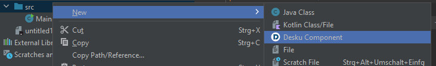

# Desku-Intellij-Plugin / Desku-Helper
Develop faster with [Desku](https://github.com/Osiris-Team/Desku) inside Intellij.

## Features
Create a Desku Component with one click, and let the plugin generate the little boilerplate there is.

<!-- Plugin description -->
## Features
Create a Desku Component with one click, and let the plugin generate the little boilerplate there is.

## Installation

- Using the IDE built-in plugin system:
  
  <kbd>Settings/Preferences</kbd> > <kbd>Plugins</kbd> > <kbd>Marketplace</kbd> > <kbd>Search for "Desku-Intellij-Plugin"</kbd> >
  <kbd>Install</kbd>
  
- Manually:

  Download the [latest release](https://github.com/Osiris-Team/Desku-Intellij-Plugin/releases/latest) and install it manually using
  <kbd>Settings/Preferences</kbd> > <kbd>Plugins</kbd> > <kbd>⚙️</kbd> > <kbd>Install plugin from disk...</kbd>
<!-- Plugin description end -->

## Developers  

---
Plugin based on the [IntelliJ Platform Plugin Template][template].

[template]: https://github.com/JetBrains/intellij-platform-plugin-template
[docs:plugin-description]: https://plugins.jetbrains.com/docs/intellij/plugin-user-experience.html#plugin-description-and-presentation

